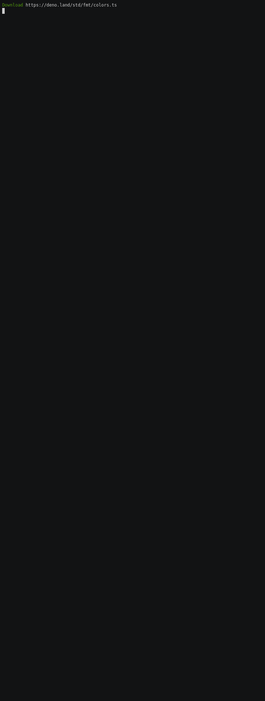

### Setup

To run this:

```sh
git clone https://github.com/orta/tsc-cli-example
deno run index.ts

# or install a watcher for FS changes
deno install --allow-read --allow-run --allow-write -f --unstable https://deno.land/x/denon/denon.ts 
denon index.ts
```

Currently looks like:


